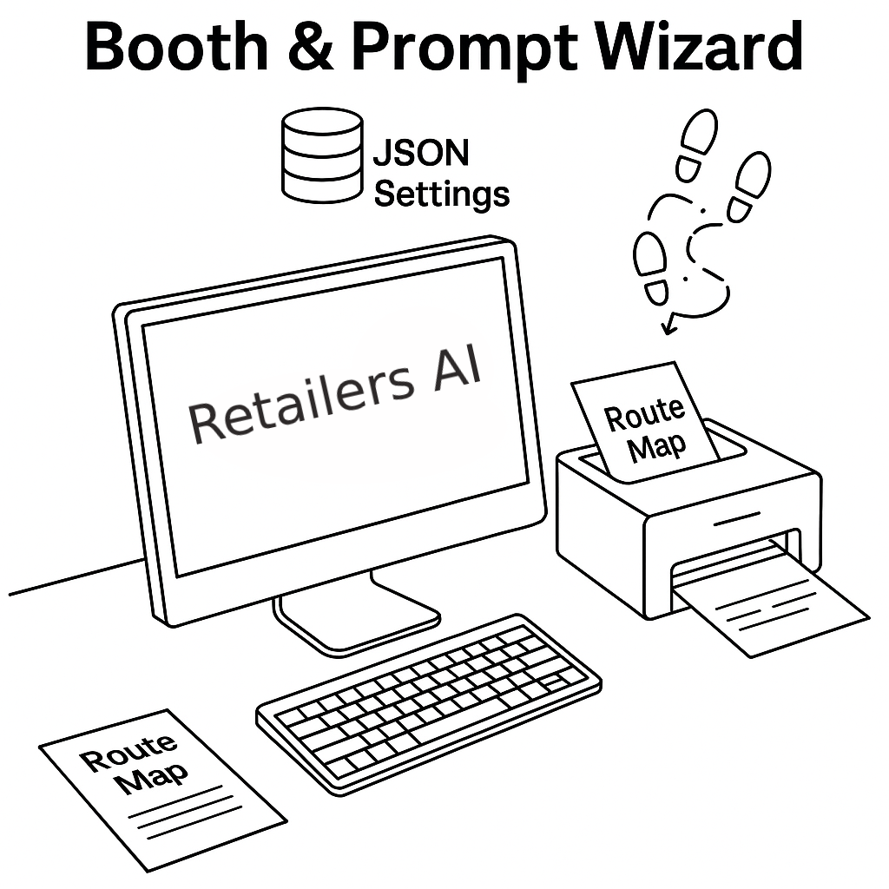

# 📍 Retail.AI Booth -- at the store frontline

The Booth contains a **Prompt Wizard** and a **RouteMap Generator**. Together with the store AI (e.g., MyLow), they deliver the following improvements:

- **Journey Planning**  
  Shoppers get optimized in-store routes for complex lists, instead of only general directions.

- **Upsell Engagement**  
  Prompt Wizard guides CS staff to apply managers’ upsell strategies early—creating leads, raising revenue, and improving outcomes.

- **Accurate Q&A**  
  With guided prompts, CS staff provide reliable product answers, avoiding lost sales and frustration.




## 🤖 What is the Retail.AI Booth?

A compact AI-powered station designed to enhance staff-customer interaction at the start of the shopping experience.

### Features:
- Touchscreen computer + keyboard  
- Guest Wi-Fi connection only  
- Local printer (for Route Maps)  

---

## 🛠️ Staff Usage Prompt (Example)

```
Hi there! Want to see how our AI can map out the best solution for your project—right here in the store?
```

---

## 🏪 Store Customization

Settings are configured by store leadership to reflect local context:
 
  1. Store weekly push  
  2. Local building codes  
  3. Local weather profile (e.g., wildfire warnings).  
  4. Up-engagement strategies
 
example **Store_Setting.json**
```
{
  "store_id": "8949",
  "zip": "92064",
  "1. "store_weekly_push": [
    {"sku": "100123456", "name": "Pressure-Treated Wood Post 4x4x8"},
    {"sku": "100456789", "name": "RYOBI 18V ONE+ Cordless Drill/Driver Kit"},
    {"sku": "100567890", "name": "Westinghouse 9500DF Dual Fuel Portable Generator"},
    {"sku": "100678901", "name": "Toshiba 12000 BTU Portable Air Conditioner"}
  ],
  "2. local_weather": {
    "condition": "hot_dry, wildfire hazard",
    "recommendations": [
      "Use outdoor-rated adhesives and corrosion-resistant fasteners",
      "Apply UV-resistant exterior stain to prolong material life",
      "Maintain defensible space by clearing vegetation near fence line",
      "Select ignition-resistant or treated lumber where feasible",
      "Avoid storing flammable materials adjacent to structures"
    ]
  },
  "3. building_codes": {
    "fence_rules": "Masonry or wood fences 6 ft or less do not require a building permit; however, clear 2-ft access to water meters and no encroachment in utility easements. (Per Poway standard plan & PMC 13.11.130.A) :contentReference[oaicite:1]{index=1}",
    "wui_requirements": "Fences in high fire risk zones must comply with Wildland-Urban Interface Code—PMC 15.24.100. :contentReference[oaicite:2]{index=2}",
    "zoning": "Fence heights regulated under PMC 17.08; front yard height rules per Title 17.08.240. :contentReference[oaicite:3]{index=3}"
  },
  "4. up_engagements": [
  "Need a list of trusted landscapers for your backyard?",
  "Thinking about adding solar lighting or panels out back?",
  "Want ideas to pair your fence with landscaping or solar upgrades?"
]
}

```

---

## 🧠 Prompt Wizard

- **Goal**: Help CS staff create optimized prompts for RetailAI (powered by LLMs like GPT-5).
- **How It Works**:
  - Chrome Extension interface  
  - Uses local settings for relevance  
  - Step-by-step UI for project workflows  
  - Generates AI-ready prompts

---

## 🗺️ From Text to Route Map

RetailAI generates detailed solutions. The assistant reformats them into printable **Route Maps**.

### Examples:
- [RouteMap--Fence Replacement](RouteMap_FenceReplace.md)  
- [RouteMap--Deck Build](RouteMap_DeckBuild.md)

💡 Optional: Offer booth visitors discount coupons with printed maps.

---

## 🧭 CS Staff Workflow

1. **Select Use Case**  
   - Type: New Build / Replacement / Renovation  
   - Category: Appliances, Garden, Patio, etc.

2. **Measure**  
   - Capture key dimensions and quantities.

3. **Text Input**  
   - List materials, structures to keep/remove, reuse options.

4. **Generate Prompt**  
   - Feed prompt to RetailAI system.

5. **Print & Review**  
   - Go over solution with customer  
   - Print Route Map and optional coupon

---

## 👤 Simon Chen — User Onboarding (UO) Program Specialist  


career focus: Customer Engagement SaaS | UO Strategy

**Clients:** Pfizer, Roche, J&J, Eisai-Biogen  

📞 (858) 733-1029  
📧 presenter.simon@gmail.com  
🔗 [LinkedIn](https://www.linkedin.com/in/hsienchen/) 

<br>
<br>
<br>

## 🎯 Past UO Works

🔗 [DFC Website – Patient Recruitment](past_UO_cases.md#dfc-website--patient-recruitment)  
🔗 [Lunch Bag CME – Physician Engagement](past_UO_cases.md#lunch-bag-cme--physician-engagement)